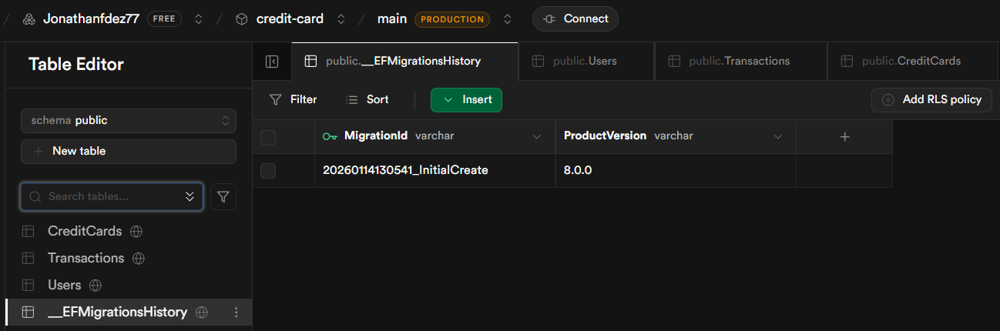
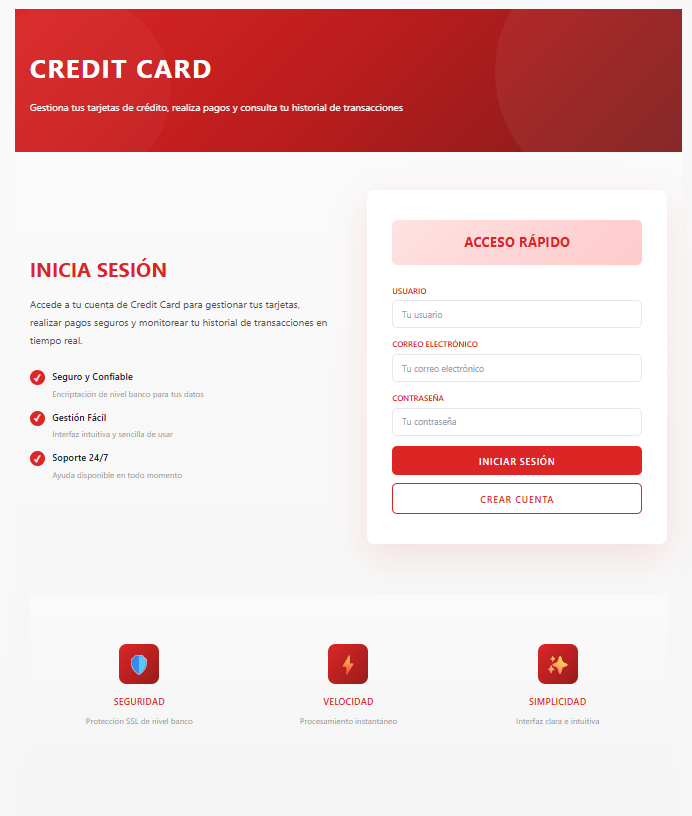
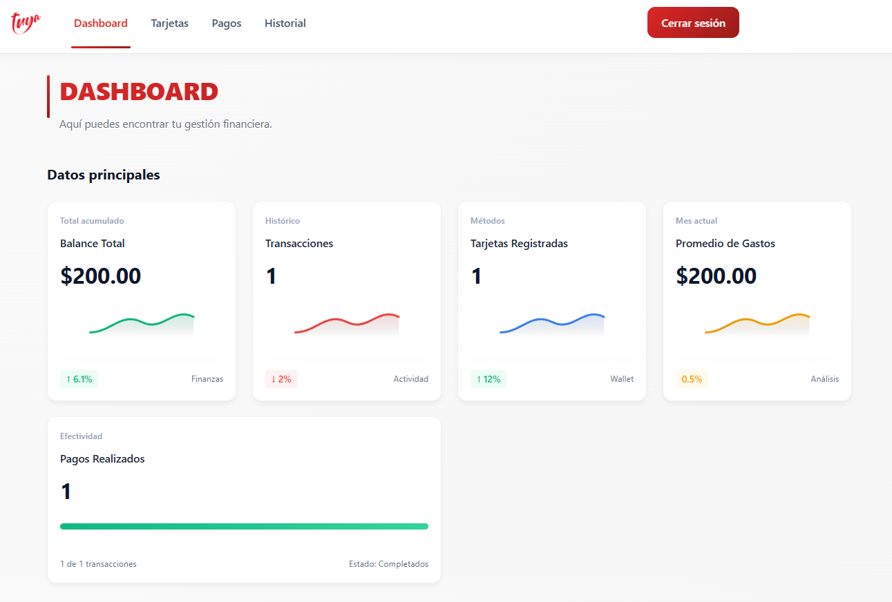
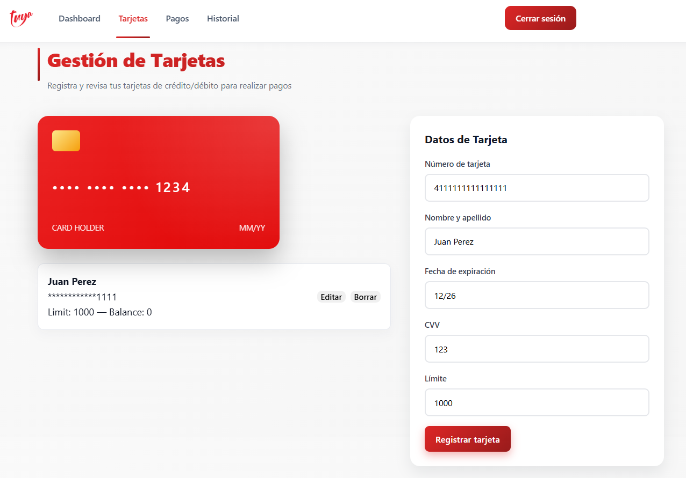
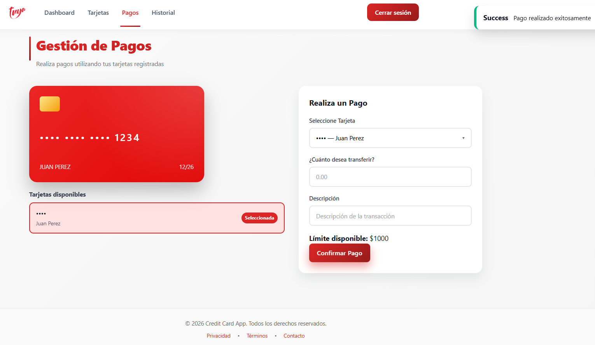
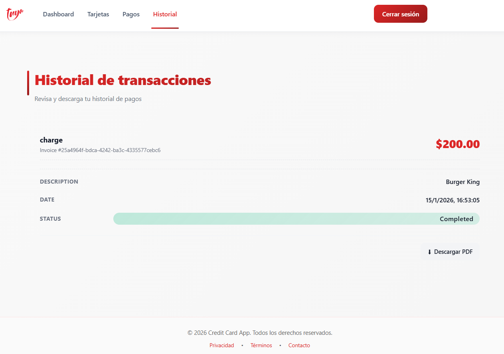

# **Aplicación de Tarjetas de Crédito - Guía de la Solución y Manual de Usuario**

---

## 🛠️ Stack tecnologico y Arquitectura


## 👤 Autor

| 👨‍💻 Nombre | 📧 Correo | 🏫 Link directo al repositorio | 🐙 Usuario GitHub |
|---|---|---|---|
| **Jonathan David Fernandez Vargas** | jonathanfdez62@gmail.com | [Link](https://github.com/Jonathand77/credit-card-tuya) | [jonathand77](https://github.com/jonathand77) |

**Desarrollo completo de la prueba técnica para el cargo de Desarrollador Full Stack - Credit Card App**

---

## 1. 🔍 Introducción
Esta guía documenta el desarrollo completo de la prueba técnica para el cargo de Desarrollador Full Stack, incluyendo la solución implementada (backend en .NET Core 8 y frontend en React + Vite), los pasos de implementación, arquitectura, y el manual de usuario para el funcionamiento de la aplicación.

## 2. ⚙️ Requisitos Previos
Antes de comenzar, asegúrate de contar con:
- Git
- .NET SDK 8+
- Node.js 18+ y npm/pnpm o yarn
- Cliente PostgreSQL: SQL Workbench/J o pgAdmin
- Cuenta en Supabase
- **Nota**: Los archivos más importantes de este repositorio cuentan con sus comentarios para su interpretación más fácil

## 3. 🛠️ Configuración del Repositorio
**Pasos:**
```bash
git init
gh repo create <tu-usuario>/credit-card-tuya --public --source=. --remote=origin
```

## 📦 Estructura del Proyecto

```
credit-card-tuya/
│
├── backend/           
│   ├── CreditCard.Api/
|       ├── Controllers/
|       ├── DTOs/
|       ├── Infrastructure/
|       ├── Mapping/
|       ├── Middleware/
|       ├── Migrations/
|       ├── Properties/
|       ├── Services/
|       ├── Validators/
|       ├── CreditCard.Api.csproj/
|       ├── Program.cs/
│   ├── CreditCard.Application/
|       ├── Interfaces/
|       ├── Services/
│   ├── CreditCard.Domain/
|       └──  Entities/
│
├── frontend/
|   ├── src/
|       ├── assets/
|       ├── components/
|       ├── context/
|       ├── pages/
|       ├── services/
|       ├── styles/
|       ├── utils/
|       ├── App.tsx/
├── CreditCardApp.sln
└── creditcard_migrations.sql
```

## 4. 🖥️ Backend - .NET Core 8
### 4.1 Crear solución y proyectos
```bash
dotnet new sln -n CreditCardApp
mkdir backend && cd backend
dotnet new webapi -n CreditCard.Api
dotnet new classlib -n CreditCard.Domain
dotnet new classlib -n CreditCard.Application
```
Agregar proyectos a la solución y referencias:
```bash
dotnet sln ../CreditCardApp.sln add CreditCard.Api/CreditCard.Api.csproj
dotnet sln ../CreditCardApp.sln add CreditCard.Domain/CreditCard.Domain.csproj
dotnet sln ../CreditCardApp.sln add CreditCard.Application/CreditCard.Application.csproj

dotnet add CreditCard.Api/CreditCard.Api.csproj reference ../CreditCard.Application/CreditCard.Application.csproj
dotnet add CreditCard.Application/CreditCard.Application.csproj reference ../CreditCard.Domain/CreditCard.Domain.csproj
```

**Agregar migraciones y referencias para llamadas, registros y vinculaciones con la base de datos:**
Dentro del archivo `creditcard_migrations.sql` se encuentra el script completo de referencia.



### 4.2 Modelos (Domain Layer)
Entidades principales:
- **User**: Id, Username, Email, PasswordHash, CreatedAt
- **CreditCard**: Id, UserId, CardNumberMasked, CardNumberHash, HolderName, Expiry, CvvHash, Limit, Balance, CreatedAt
- **Transaction**: Id, CardId, UserId, Amount, Type, Timestamp, Description, BalanceAfter

### 4.3 Persistencia con EF Core y Postgres
- Añadir paquetes:
```bash
dotnet add package Microsoft.EntityFrameworkCore --version 8.0.0
dotnet add package Npgsql.EntityFrameworkCore.PostgreSQL --version 8.0.0
dotnet add package Microsoft.EntityFrameworkCore.Design --version 8.0.0
```
- Crear `AppDbContext` y configurar `appsettings.Development.json` con la conexión a Supabase.
- Registrar DbContext en `Program.cs`.

### 4.4 Autenticación JWT
- Endpoints: `/api/auth/register`, `/api/auth/login`
- Guardar `PasswordHash` usando BCrypt
- Configurar JwtBearer en `Program.cs`
- Todas las rutas sensibles protegidas con `[Authorize]`

### 4.5 Endpoints de Tarjetas y Transacciones
- **CardsController**: CRUD tarjetas
- **PaymentsController**: POST /api/payments para registrar pagos
- **TransactionsController**: GET /api/transactions con filtros por `cardId`, `userId` y paginación

### 4.6 Buenas Prácticas y Arquitectura
- **Arquitectura hexagonal**: Domain, Application, Infrastructure, API
- Repositorios e interfaces
- **Servicios de dominio** (CardService, PaymentService, TransactionService)
- **DTOs y AutoMapper**
- **Validación con FluentValidation**
- **Middleware de manejo de errores**

## 5. 🚀 Frontend - React + Vite
### 5.1 Scaffold y estructura
```bash
npm create vite@latest frontend -- --template react-ts
```
Estructura:
- `src/pages/`: Login.tsx, Dashboard.tsx, Cards.tsx, Payments.tsx, History.tsx, ETC
- `src/components/`: CardForm.tsx, CardList.tsx, PaymentForm.tsx, ETC
- `src/styles/`: Estilos para los diferentes componentes y pages
- `src/services/api.ts`: llamadas HTTP a backend

### 5.2 Autenticación en frontend
- Login UI con formulario
- Guardar JWT en localStorage o guardar en Base de Datos (supabase)
- Interceptor para Authorization Bearer en todas las peticiones
- Configurar CORS en backend para dev server

### 5.3 Componentes clave
- **LoginPage**: autenticación



- **DashboardPage**: Gestion financiera del usuario



- **CardsPage**: listar y gestionar tarjetas



- **PaymentPage**: registrar pagos



- **HistoryPage**: historial de transacciones



## 6. 🧪 Ejecución y Pruebas
### 6.1 Backend
- **Ejecución para registrar en la base de datos:**
```bash
cd backend/CreditCard.Api
dotnet run --urls "http://localhost:5000"
```
- **Ejecución para registrar de manera local LocalStorage/IN_MEMORY:**
```bash
cd backend/CreditCard.Api
export USE_INMEMORY=true
dotnet run --urls "http://localhost:5000"
```

### 6.2 Frontend
```bash
cd frontend
npm install
npm run dev
```
### 6.3 Pruebas manuales (En mi caso use Postman)
- **Registrar usuario**: POST /api/auth/register
```bash
{ "username": "Pepito123",
  "email": "Pepito@gmail.com",
  "password": "P@ssw0rd!"	}
```
- **Login**: POST /api/auth/login
```bash
{ "username": "Pepito123",
  "email": "Pepito@gmail.com",
  "password": "P@ssw0rd!"	}
```
- **CRUD tarjetas**: GET, POST, PUT, DELETE /api/cards
```bash
{ "cardNumber": "41111111111111111",
  "holderName": "Pepito Perez",
  "expiry": "12/26",
  "cvv": "123",  "limit": 5000	}
```
- **Pagos**: POST /api/payments
```bash
{ "cardId": "f002063a-f8dc-44b0-847e-4795a725756e",
  "amount": 300.50,
  "description": "Compra en Burger King"	}
```
- **Historial**: GET /api/transactions
```bash
{   "page": 1,
    "size": 10,
    "items": [
        {	"cardId": "f002063a-f8dc-44b0-847e-4795a725756e"  }
    ]
}
```

## 7. 🌐 Seguridad
- No almacena CVV ni PAN completo
- Se usa HTTPS
- Se Guarda JWT secret y claves Supabase en variables de entorno
- Se manejan Toast para las alertas correspondientes a los manejos indebidos o errores de usuario

## 8. 📝 Manual de Usuario
1. Ejecutar Backend en el navegador (http://localhost:xxxx o URL pública de Codespaces)
2. Abrir la aplicación en el navegador (`http://localhost:xxxx`)
3. Registrarse o iniciar sesión
4. Gestionar tarjetas:
   - Crear tarjeta
   - Editar tarjeta
   - Eliminar tarjeta
5. Registrar pagos a las tarjetas
6. Consultar historial de transacciones con filtros y paginación
7. Consulta todas tus estadísticas en el Dashboard

## 9. 📊 Próximos pasos
- Se pueden realizar Unit tests para ver el correcto funcionamiento interno de cada vista o componente.
- Se pueden realizar pruebas E2E tests para validar el flujo correcto de un usuario.
- Se puede implementar el Dark mode, las notificaciones, el rate limiting, caching, ETO

---
## **Fin de la guía y manual de usuario.**
